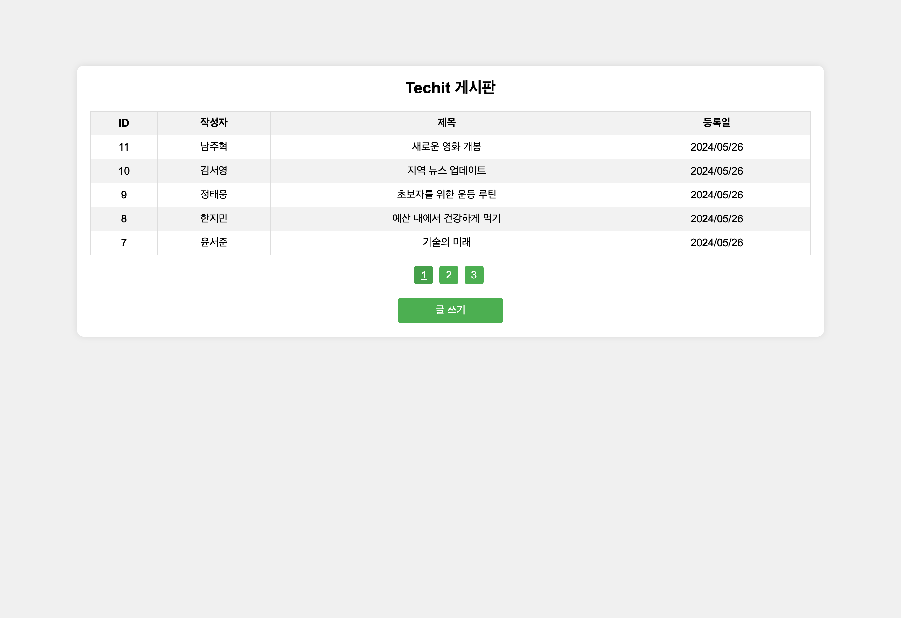
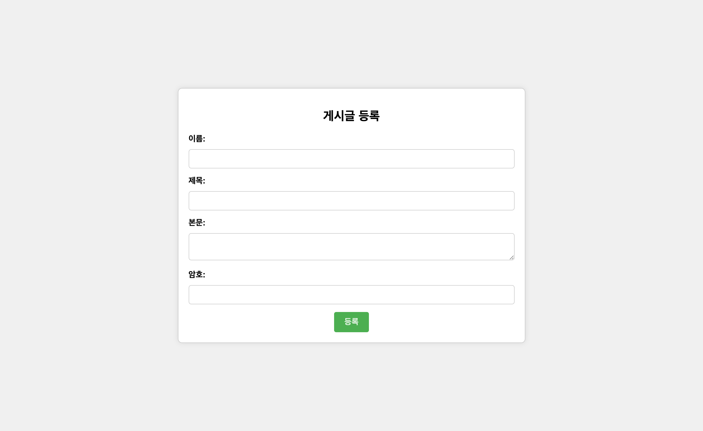
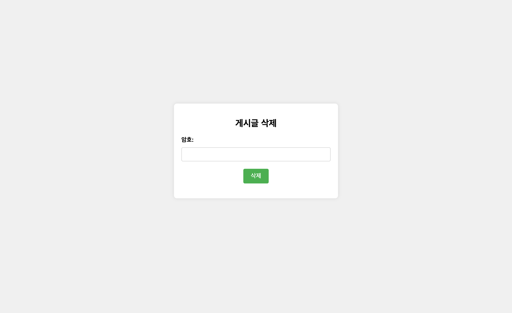
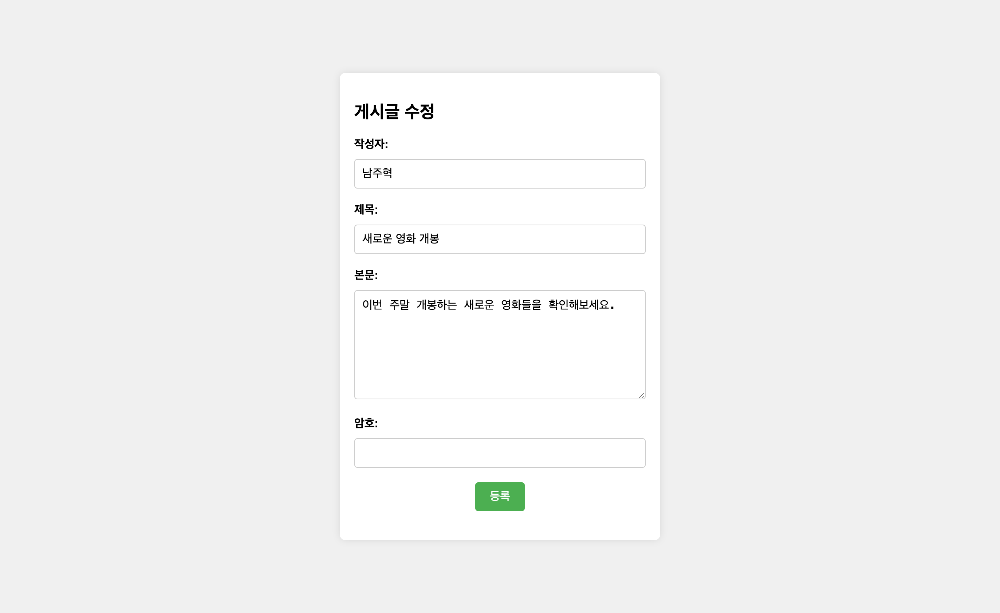

## Spring Boot, Spring Data JDBC, Spring MVC를 이용한 게시판 만들기

## 1. 프로젝트 요구 사항

### 글 등록
- 이름, 제목, 암호, 본문을 입력
- 등록일, ID는 자동으로 저장

### 글 목록 보기
- 최신 글부터 보여짐
- ID, 제목, 이름, 등록일(YYYY/MM/DD) 형식으로 목록이 보여짐
- 페이징 처리 필요

### 글 상세 조회
- 암호는 보여지면 안됨
- 글 등록일은 YYYY/MM/DD hh24:mi 형식으로 보여짐

### 수정
- 이름, 제목, 본문을 수정
- 암호는 글 등록시 입력했던 암호를 입력해야함
- 수정일은 자동으로 저장

### 삭제
- 암호는 글 등록시 입력했던 암호를 입력해야함

<br>

## 2. DB 테이블 설계 및 Sample Data

### Board 테이블 생성
```sql
CREATE TABLE board (
id BIGINT AUTO_INCREMENT PRIMARY KEY,
name VARCHAR(100) NOT NULL,
title VARCHAR(255) NOT NULL,
password VARCHAR(255) NOT NULL, -- 암호는 해싱하여 저장하는 것이 좋습니다
content TEXT NOT NULL,
created_at DATETIME DEFAULT CURRENT_TIMESTAMP, -- 등록일
updated_at DATETIME DEFAULT CURRENT_TIMESTAMP ON UPDATE CURRENT_TIMESTAMP -- 수정일
);
```

<br>

### 예제 데이터 삽입
```sql
INSERT INTO board (name, title, password, content) VALUES
('김민수', '첫 번째 글입니다!', 'password123', '이것은 첫 번째 게시글의 내용입니다.'),
('이지은', '봄철 원예 팁', 'password123', '봄철 정원 가꾸기에 유용한 팁을 공유합니다.'),
('박영희', '올해의 여행지 추천 10곳', 'password123', '올해 방문하기 좋은 여행지 10곳을 소개합니다.'),
('최준호', 'SQL 이해하기', 'password123', 'SQL과 그 기능들에 대해 깊이 있게 알아봅시다.'),
('황소연', '최고의 코딩 습관', 'password123', '모든 개발자가 따라야 할 코딩 습관에 대해 알아봅시다.'),
('백은영', '사진 촬영 기초', 'password123', '초보자를 위한 사진 촬영 가이드입니다.'),
('윤서준', '기술의 미래', 'password123', '기술과 혁신의 미래에 대한 예측을 해봅니다.'),
('한지민', '예산 내에서 건강하게 먹기', 'password123', '예산을 깨지 않고 건강하게 먹는 방법을 공유합니다.'),
('정태웅', '초보자를 위한 운동 루틴', 'password123', '운동을 막 시작한 사람들을 위한 효과적인 운동 루틴을 소개합니다.'),
('김서영', '지역 뉴스 업데이트', 'password123', '최신 지역 뉴스를 업데이트합니다.'),
('남주혁', '새로운 영화 개봉', 'password123', '이번 주말 개봉하는 새로운 영화들을 확인해보세요.');
```

<br>

## 3. URL 구조

### 게시글 목록 보기 (`/list`)
```
- **URL:** `/list`, `/list?page=2`
- **기능:**
    - 게시글 목록을 페이지별로 보여줍니다.
    - `page` 파라미터가 없으면 기본적으로 1페이지를 보여줍니다.
    - 각 페이지는 최신 글부터 보여지며, 페이징 처리가 적용되어 있습니다.
    - 하단에는 페이지 네비게이터가 있어 다른 페이지로 쉽게 이동할 수 있습니다.
    - 각 게시글은 ID, 제목, 이름, 등록일(YYYY/MM/DD 형식)로 목록이 구성됩니다.
```
<br>

### 게시글 등록 폼 (`/writeform`)
```
- **URL:** `/writeform`
- **기능:**
    - 특정 게시글을 쓰기위한 폼을 제공합니다.
    - 사용자는 이름, 제목, 내용, 암호를 입력하고, 확인 버튼을 클릭하여 등록을 요청합니다.
    - 모든 내용이 잘 입력되어 있을 경우 `/write`로 요청을 보내 등록 처리 후 `/list`로 리다이렉트됩니다.
```
<br>

### 게시글 상세 조회 (`/view?id=아이디`)
```
- **URL:** `/view?id=아이디`
- **기능:**
    - 특정 게시글의 상세 내용을 보여줍니다.
    - 삭제와 수정 링크를 제공하여 해당 기능을 수행할 수 있는 페이지로 이동할 수 있습니다.
    - 게시글의 등록일은 YYYY/MM/DD hh24:mi 형식으로 표시됩니다.
    - 게시글의 암호는 보여지지 않습니다.
```
<br>

### 게시글 삭제 폼 (`/deleteform?id=아이디`)
```
- **URL:** `/deleteform?id=아이디`
- **기능:**
    - 특정 게시글을 삭제하기 위한 폼을 제공합니다.
    - 사용자는 암호를 입력하고, 확인 버튼을 클릭하여 삭제를 요청합니다.
    - 올바른 암호 입력 시, `/delete`로 요청을 보내 삭제 처리 후 `/list`로 리다이렉트됩니다.
```
<br>

### 게시글 수정 폼 (`/updateform?id=아이디`)
```
- **URL:** `/updateform?id=아이디`
- **기능:**
    - 특정 게시글을 수정하기 위한 폼을 제공합니다.
    - 이름, 제목, 본문, 암호 필드를 포함하며, 사용자는 이를 수정할 수 있습니다.
    - 확인 버튼을 클릭하면 `/update`로 수정 요청을 보내고, 수정이 완료되면 해당 게시글의 상세 페이지(`/view?id=아이디`)로 리다이렉트됩니다.
```
<br>

## 4. 개발 단계

### 환경 설정
- Spring Boot 프로젝트 생성
- 필요한 의존성 추가 (Spring Web, Spring Data JDBC 등)

### 데이터베이스 구성
- SQL 스크립트를 사용하여 Users, Posts, Comments 테이블 생성 및 초기 데이터 삽입

### 도메인 모델 생성
- 테이블에 는 Java 클래스(도메인 모델) 생성

### DAO 개발
- Spring Data JDBC를 이용한 Repository 인터페이스 구현

### 서비스 계층 구현
- 비즈니스 로직을 수행하는 서비스 클래스 구현

### 컨트롤러 구현
- 컨트롤러 클래스 구현
- thymeleaf템플릿 작성

<br>

## 5. 실행 화면

### 게시글 목록 보기(`/list`)


### 게시글 상세 조회(`/view?id=아이디`)


### 게시글 등록 폼(`/writeform`)


### 게시글 삭제 폼 (`/deleteform?id=아이디`)


### 게시글 수정 폼 (`/updateform?id=아이디`)
